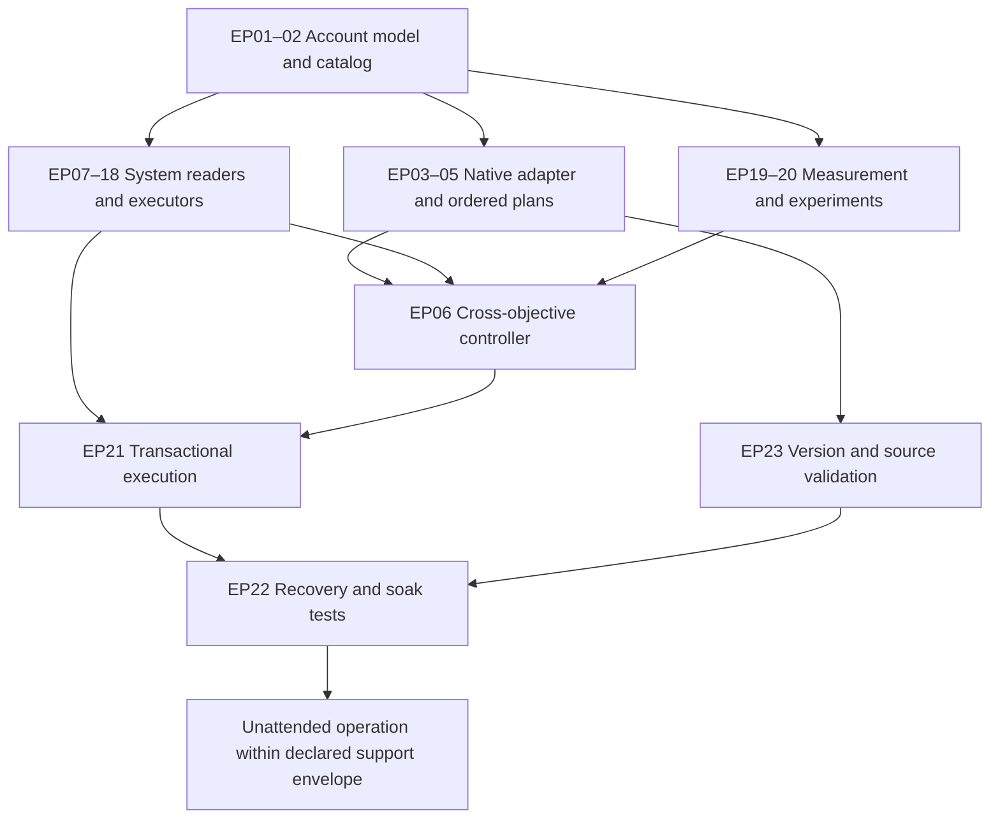

# Effective Paths: source audit and automation requirements

Research date: 2026-09-05. Scope: public Effective Paths landing page, complete written setup guide, current public workbook structure/FAQ, and the repository's existing advisor integration. This is an implementation assessment, not a populated recommendation for this player's account.

## Reading coverage and source freshness

The [Effective Paths landing page](https://the-tower.notion.site/Effective-Paths-1bb91383b93f80d5aed2c098cbbd9e46) was read, including its related-term index. The [written setup guide](https://the-tower.notion.site/Guide-to-Setting-Up-and-Using-the-Effective-Paths-1e591383b93f80379b0ec8b94fc5ba0f) was loaded completely in a background browser and its 87 initially collapsed toggles expanded; the resulting rendered text was 62,401 characters, through “Final Words.” Its table-of-contents links are sections in that document, not separate guide articles. The web crawler initially exposed only the introductory chunk, so that response alone would not have constituted a complete read. Illustrative screenshot images and linked tutorial videos were not independently transcribed; the written instructions were read. Linked child workbooks were identified, but their entire formula implementations were not audited or executed.

The [live workbook](https://docs.google.com/spreadsheets/d/1YwZtKP6B4WYhRba5T6APJ1YxKNdfnIGQnprgnxmO7zc/edit) identifies itself as **v5.10.03.00**, while the landing-page embed still labels an older v4 release. A public XLSX export was retrieved read-only and its 31 worksheet names and selected schema labels examined. Its values are template data, not the player's account. No account was connected, spreadsheet copied, external script installed, or game action performed. Source metadata is in [the source manifest](./2026-09-05-effective-paths-sources.json).

## What the sources establish

The setup guide describes account-specific optimization, not universal progression stages. Inputs span labs, Workshop/enhancements, ultimate weapons, themes/songs, bots, relics, Vault, cards, modules, and Guardians. Workshop base/run levels differ; UW/bot inputs exclude other bonuses; lab menus can display the next level. Farming and tournament presets differ. Health assumptions distinguish Wall/recovery, permanent Chrono Field, and achievable Death Wave health. Damage estimates include hit distribution, range, stacking, and crowd control. Economy estimates include kill coverage, tier, purchases already owned, and synchronization. GT+ changes duration-sync treatment. Independent paths cannot predict all benefits of extending runs. [Setup guide](https://the-tower.notion.site/Guide-to-Setting-Up-and-Using-the-Effective-Paths-1e591383b93f80379b0ec8b94fc5ba0f).

The current workbook has health/time, health/stones, health/coins, regeneration, damage/time, damage/stones, damage/coins, damage/keys, economy/time, economy/stones, and discount outputs. It includes primary/assist module and perk-preset inputs. Its FAQ excludes a standard Workshop path, points to higher-priority labs outside the optimizer, and cautions that damage/economy estimates are approximate. Recent changelog entries alter presets, masteries, Vault support, and economy path structure. [Current workbook and FAQ](https://docs.google.com/spreadsheets/d/1YwZtKP6B4WYhRba5T6APJ1YxKNdfnIGQnprgnxmO7zc/edit).

**Consequently, no honest fixed purchase order can be produced without current account inputs and a selected objective.** A bot must obtain recalculated paths for the actual account, then apply context, prerequisite, budget, and confidence checks. A list of example upgrades from the public template would be the wrong plan for the user.

## Existing integration, verified in source

The working tree contains an implementation beyond the older proposal's “no connection or automatic recommendations implemented” wording:

- `advisor.py` parses strict normalized JSON/CSV, records source/account/export metadata, validates identities and numeric data, rejects formula input, and stores imports atomically per profile. It does no network/device I/O and no spreadsheet calculation.
- Its vocabulary has health/damage/economy paths; Workshop/lab/UW/enhancement/other systems; coins/gems/stones/medals/time/other currencies. There are no dedicated keys, cells, module-shard, reroll-shard, Guardian, Vault, or bot execution representations.
- `_blocked_reason` permits draft staging only for known ordinary Workshop statistics, coin cost, displayed-stat target, known cost/current/target, fresh input, and an improving target. Unlocks, labs, UWs, enhancements, and all other systems remain advisory.
- Freshness is presently a global 24-hour account-snapshot cutoff. Missing-input strings block staging. This does not establish per-field completeness, in-game identity, real-time consistency, or recalculation freshness.
- `web/ui/components/AdvisorPanel.tsx` explicitly identifies local normalized import and says Google Sheets syncing is not connected. Loading/importing and staging are deliberate UI steps. Staging modifies a draft; separate strategy save behavior remains.
- `web/advisor.py` provides the extracted API router, included by `web/app.py`. The older integration spec remains a useful design record, but should not be mistaken for current implemented state.

Relevant files: `advisor.py`; `web/advisor.py`; `web/ui/components/AdvisorPanel.tsx`; `docs/superpowers/specs/effective-paths-integration.md`; `docs/superpowers/plans/2026-09-05-effective-paths.md`. The running working tree was changing during this audit, so these are verified responsibilities rather than immutable line references.

**The major mismatch:** the advisor can stage ordinary Workshop stat purchases, while native Effective Paths does not supply an ordinary Workshop progression path. Showing imported rows is useful groundwork; it is not yet an executable Effective Paths integration.

## Proposed rule-to-capability matrix

The following is our engineering design inferred from the source constraints and current code, not an upgrade order asserted by the community tool. Every execution row should carry a game-version and source-version boundary.

| ID | Missing capability | State/rule contract | Acceptance evidence |
|---|---|---|---|
| EP01 | Complete account snapshot | Stable account ID; field-level values, units, observation time, source, confidence, unlock state, and unknown state; separate permanent, equipped, and run-modified values | All required adapter fields resolved without silently filling unknowns with zero |
| EP02 | Canonical entity catalog | Separate IDs for levels, displayed effects, upgrades, unlocks, currencies, inventories, and prerequisites | Every supported source label round-trips to exactly one game action and observation |
| EP03 | Native source adapter | Pin workbook/IDS versions; discover ranges/anchors and output families; never rely solely on historical guide coordinates | Compare normalized output against a populated, recalculated player workbook across at least two supported versions |
| EP04 | Calculation freshness protocol | Input hash + source versions + preset identity + completed-recalculation marker; distinguish loading/errors from results | Stale result cannot become executable after account state changes |
| EP05 | Ordered recommendations | Preserve order, current/target level, marginal and cumulative costs, benefit metric, prerequisites, and atomic bundles | Next eligible recommendation agrees with source; partial bundles never break required invariants |
| EP06 | Cross-objective controller | Choose farming, tournament, or milestone objective; decide budgets for progression versus health/damage/economy | Explain why a lower local ROI action wins for total account progression |
| EP07 | Lab execution and scheduling | Unlocks, owned slots, current/completing research, target levels, duration, coin reservation, cell boosts, gem-rush policy | Idle slot starts correct eligible research; completed level verified once; boosts remain sustainable |
| EP08 | Permanent Workshop progression | Independent prerequisite/unlock policy, coin allocation, levels and enhancement thresholds, affordability horizon | Early progression works when native optimizer supplies no useful ordinary Workshop action |
| EP09 | Enhancement executor | Correct enhancement menu, purchase units, cumulative unlock spending, caps and reserves | Purchased effect and coin delta verified; no accidental adjacent enhancement |
| EP10 | UW and UW+ executor | Owned/unlocked weapons, offered selections, raw levels, costs, cooldowns, duration, quantity, plus abilities | Save toward a multi-step plan; verify each action and resulting weapon state |
| EP11 | Synchronization solver | Compute allowed cooldown/duration changes across GT/BH/DW/Golden Bot, module effects, lab bonuses, and current run toggles | Reject individually attractive purchases that leave the configured timing relationship invalid |
| EP12 | Cards and masteries | Inventory, duplicates, star levels, slots, active/loadout presets, mastery unlocks/labs, run-switch restrictions | Reconstruct exact effective loadout; swap only valid cards and verify effects |
| EP13 | Modules and assists | Every instance's type, rarity, level, unique effect, substats/rarities, primary/assist position, presets, shards | Account import and equipped state agree, including duplicate instances and assist contribution |
| EP14 | Module progression actions | Level/restore, merge, shatter, reroll, lock/ban effects, budgets and protected inventory | Bound stochastic searches; never destroy designated keepers; verify new state before recalculating |
| EP15 | Bots | Ownership, raw stats, medal costs, lab effects, toggles and presets | Planner can apply eligible bot upgrades while honoring synchronization and event budget |
| EP16 | Themes, songs, skins, relics | Ownership ledger and effects, milestone/event availability, claim status, currency-specific purchase policy | Newly acquired bonuses flow once into account state and optimizer inputs |
| EP17 | Vault | Keys, unlocked nodes/tiers, prerequisite edges, Power/Harmony allocation and quality-of-life priorities | Execute eligible node; do not spend the same reserved keys in competing plans |
| EP18 | Guardians | Unlocked chips, levels/effects, currencies, loadout, abilities, guild-related acquisition dependencies | Observe, choose, execute, and verify each supported chip progression path |
| EP19 | User-estimate replacement | Collect empirical coverage, uptime, enemy interactions, target-hit distribution, boss cadence, cash, and cause of death | Confidence intervals accompany estimates; uncertain assumptions trigger measurement before spending |
| EP20 | Run-outcome optimization | Coins/cells per real hour, wave length, deaths, ELS max wave, farming tier, recovery overhead | Paired or repeated runs show benefit before permanently changing strategic policy |
| EP21 | Transactional action layer | Before/after evidence, intended cost/target, single-writer device control, idempotency, bounded retries | Lost acknowledgement never repeats an already completed spend |
| EP22 | Recovery and autonomous degradation | Resume observation after disconnect, modal, crash, stale sheet, or game update; preserve unfinished intent | Known recovery reaches valid state; unsupported state safely parks spending and records actionable reason |
| EP23 | Version drift and regression corpus | Source schema changes, game UI/effect changes, stored snapshots, fixtures and rollout support matrix | Unknown change disables affected actions while unaffected farming can continue |

## Strategy branches that need explicit tests

These are proposed scenario tests, not claims that the current bot supports them:

1. Early account, incomplete unlocks, and no meaningful native paths: the independent progression policy advances prerequisites and builds a complete snapshot.
2. Farming with recovery packages, then Wall unlocked: loadout and survivability model change together; lab priority is recalculated.
3. Short milestone attempt: a benefit requiring long-run stacking cannot be treated as immediately available.
4. Damage versus survivability bottleneck: select experiments and investment according to observed failure, not the largest displayed multiplier.
5. Switching to tournament: change applicable cards/modules/perks, battle conditions, boss cadence, and objective before evaluating any path.
6. UW cooldown plan needing several purchases: reserve the full required budget, maintain an invariant throughout execution, and re-read values between steps.
7. GT+ or a synchronization module acquired: invalidate timing assumptions and re-evaluate the entire dependent economic plan.
8. Enhancement or module unlock threshold approaching: compare the immediate upgrade with saving toward the unlock, including the option value of future actions.
9. A lab completes while a recommendation is pending: reject the outdated recommendation or rebuild it from the new snapshot.
10. A new optimizer release changes a column, preset convention, or supported mechanic: require compatibility validation before accepting newly generated actions.
11. Sheet timeout or missing account field: continue only independently justified actions; do not manufacture optimizer output.
12. Repeated stochastic rerolls or disconnect during a purchase: enforce the reserved budget and recover by reading actual state, not replaying clicks.

## Implementation sequence and completion gates

1. **Observe:** collect a complete supported account and stable outcome telemetry; reconcile level versus effect semantics. Gate: no unresolved field needed by the chosen path.
2. **Advise:** connect or import native calculated outputs with version and input hashes; run in shadow mode. Gate: reproducible agreement with the player's populated source and explanations for rejected actions.
3. **Execute gradually:** first proven deterministic low-risk actions, then synchronization bundles and multi-currency plans, then stochastic inventory systems. Gate: before/after verification, exactly-once intent handling, and no budget overrun.
4. **Optimize across systems:** add objective arbitration, unlock savings, event/tournament scheduling, sustainable labs, and empirical estimates. Gate: improved measured progression without hidden manual restarts or data entry.
5. **Qualify unattended operation:** multi-day runs spanning completions, restarts, scheduled activities, disconnections, and source changes. Gate: every supported situation recovers or parks safely with preserved state; explicitly document situations still requiring initial authorization, unsupported UI, or external service recovery.

“Fully autonomous” should mean no routine human choice, data re-entry, or recovery inside the tested support envelope. An absolute promise covering all future game changes, unavailable services, or account challenges cannot be established by a feature checklist. The supported version, device, account stage, game modes, and recovery boundaries must be part of the product's completion definition.
