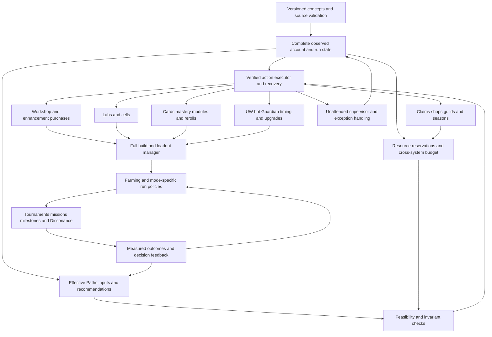

# Tower Hub wiki audit for autonomous bot planning

Retrieved 2026-09-05. This is a gameplay taxonomy and requirements input, not a statement about what the bot already implements. Bot code/runtime coverage is audited separately.

## Coverage and evidence

The recursive crawl started from [the wiki root](https://www.tower-hub.com/wiki), [all guides](https://www.tower-hub.com/wiki/guide), and [the glossary](https://www.tower-hub.com/glossary). It reached **247 English pages: 234 reference articles, 11 category indexes, the root, and the glossary. All returned successfully; no linked English wiki route failed.** Categories contain 10 UW, 48 Workshop, 21 Lab, 5 Bot, 35 Card, 6 Module, 14 Enemy, 11 Currency, 32 Guide, 28 Patch, and 24 System articles.

The corpus includes 1,190,828 characters of extracted article/index text. Long tables are collapsed in initial HTML. Public Next.js hydration supplied **553 complete table objects containing 16,817 rows**, including overview/detail duplicates. These were extracted rather than assuming the first ten displayed rows were complete. Some long cells contain framework string references and some source tables have malformed nested rows: these snapshots are evidence, **not a production-ready price database**. Numbers have not been individually validated against the installed game.

The team completed full prose review of **all 206 non-patch reference articles**: this research agent reviewed 90 (24 System, 21 Lab, 10 UW, 5 Bot, 30 Guide); the code audit agent reviewed 114 (48 Workshop, 35 Card, 11 Currency, 14 Enemy, 6 Module); the main agent reviewed the two remaining long guides, `tier-specific-guide` and `orbless-guide`. See `wiki-source-2026-09-05/reviewed-by-wiki-audit.json` and `2026-09-05-wiki-supplement.md` for exact review sets. Full prose review does not mean each claim is true or every cost row was checked. The 28 historical patch articles were fetched and indexed for version context, not treated as current rules or exhaustively interpreted line by line.

The exact **159 glossary entries**, their stable site anchor IDs, domains, and source links are in `wiki-source-2026-09-05/glossary-terms.json`. Definitions are deliberately marked unverified because several are materially wrong. A second `concept-inventory.json` contains **516 extracted catalog entries**: 31 cards, 31 masteries, 24 natural epic modules, 73 module substats, 116 Vault nodes, 34 perks, 49 mission table rows, and 158 lab overview entries. These counts are catalog evidence, not claims that the overview contains every current lab or that removed missions are active.

`manifest.json` contains every canonical URL, response status, content hash, title, headings, source files, tables, and verification dates. Most articles display July 29–30, 2026 verification dates; the latest Vault article displays August 28, 2026. Their separate Fandom last-edited dates can be much older. A verification badge does not resolve contradictions.

## Important source limitations

**The glossary must be an alias dictionary, not the bot's rules engine.** Among its conflicts with dedicated pages: Galaxy Compressor is called a Core but appears under Generator modules; Enemy Balance is described as reducing spawns while its card does the opposite; Fortress is presented as wall-focused although its base effect is Defense Absolute; Plasma Cannon is described as wall thorns although its base effect attacks bosses; Demon Mode is described as having a defensive cost although it grants invincibility; Death Ray is described as boss/elite insurance although its dedicated page excludes these targets. The glossary also lists four bots while current systems contain five. Compare [glossary](https://www.tower-hub.com/glossary), [module effects](https://www.tower-hub.com/wiki/module/epic-module-unique-effect), [Enemy Balance](https://www.tower-hub.com/wiki/card/cards-enemy-balance), [Fortress](https://www.tower-hub.com/wiki/card/cards-fortress), [Plasma Cannon](https://www.tower-hub.com/wiki/card/plasma-cannon), [Demon Mode](https://www.tower-hub.com/wiki/card/demon-mode), and [Death Ray](https://www.tower-hub.com/wiki/card/death-ray).

Other material inconsistencies require version-specific validation:

- **UW+ purchase costs:** [Ultimate Weapons](https://www.tower-hub.com/wiki/uw/ultimate-weapons) describes increasing unlock prices; the newer [UW tier list](https://www.tower-hub.com/wiki/guide/uw-tier-list) states a flat 975 stones per ability. Do not hardcode either without current in-game confirmation.
- **Fleet spawn scope:** [Fleet Enemies](https://www.tower-hub.com/wiki/enemy/fleet-enemies) opens with T14+ exclusivity but later explicitly documents high-wave Fleets on every tier.
- **Caps and newer systems:** [Free Upgrades](https://www.tower-hub.com/wiki/workshop/free-upgrades) states an obsolete 90.75% maximum alongside overflow above 100%; the current [Vault](https://www.tower-hub.com/wiki/system/the-vault) has three trees, extra presets, sliders, and life-saving ordering, while older pages assume fewer features.
- **Generic overviews are incomplete:** [Gameplay](https://www.tower-hub.com/wiki/system/gameplay) still mentions six enemy types and an incomplete currency set. [Shards](https://www.tower-hub.com/wiki/currency/currency-shards) is a stub; the Module pages have the substance.
- **Old strategy recipes:** [Devo](https://www.tower-hub.com/wiki/guide/devo-guide) explicitly warns it predates a DW rework; older [medal advice](https://www.tower-hub.com/wiki/guide/medals-guide) still assumes four bots. [IceTæ's list](https://www.tower-hub.com/wiki/system/icet-s-gem-and-card-priority-list) dates to versions 0.16–0.17. Numerical targets from these must not silently become defaults.
- **Within-page disagreements:** [Chips](https://www.tower-hub.com/wiki/system/chips) describes universal nearest targeting and then Attack targeting missing health; [Bot Bot](https://www.tower-hub.com/wiki/bot/bot-bot) prose gives a bonus increment inconsistent with its table; [Dissonant Runs Guide](https://www.tower-hub.com/wiki/guide/dissonant-runs-guide) alternates between starting at T1 and the farming tier and omits a package exception documented by the system article.
- **Pointer pages:** [Advanced Analysis](https://www.tower-hub.com/wiki/guide/advancedanalysis) has a content placeholder. [100% AFK Orb Devo](https://www.tower-hub.com/wiki/guide/guides-100-afk-orb-devo) and [50s SMax](https://www.tower-hub.com/wiki/guide/guides-50s-smax) describe live external guides without embedding their actual strategies. Reading every Hub page does not imply reading those external documents.

- **Conditional strategies cannot be merged into one priority list:** [Tier-Specific Guide](https://www.tower-hub.com/wiki/guide/tier-specific-guide) gives gem/card and BH-damage advice that differs from other guides. [Orbless](https://www.tower-hub.com/wiki/guide/orbless-guide) needs multiple run phases, deferred perks, controlled kill timing, and an eventual cells-focused transition; its rules are a build branch rather than global defaults.

## Domain map and required control surface

The following requirements are inferences for automation from the cited mechanics. Each domain needs persistent state, reliable observation, legal actions with preconditions, policy decisions, and observed postconditions.

### D01 — Account state, version, vocabulary, and clocks

Track player identity, installed game version, settings, unlocks, highest tier/wave, lifetime earnings, persistent inventory, current run, active overlays, and update/cloud-save state. Distinguish run, wave, wall-clock time, simulation time, and wave-based recharge. Normalize case-sensitive suffixes and units; `q` and `Q` differ by three orders of magnitude. Resolve ambiguous abbreviations by namespace: PC can mean Plasma Cannon or Primordial Collapse; CC can mean critical chance, critical coin, or crowd control; WS can mean Workshop or Wave Skip. Store canonical IDs independently of OCR labels. Sources: [Gameplay](https://www.tower-hub.com/wiki/system/gameplay), [Common Abbreviations](https://www.tower-hub.com/wiki/guide/common-abbreviations), [More Round Stats](https://www.tower-hub.com/wiki/workshop/more-round-stats).

### D02 — Currency ledger and resource allocation

Model cash separately from persistent coins; gems; stones; medals; cells; keys; bits; seasonal tokens; four module shard pools; reroll shards; tournament tickets; and module draw tickets where available. Track source, balance, reserved amount, expiry/reset rules, escalating shop costs, and spending commitments. A coin purchase can starve a lab; spending medals can lose a limited relic; spending stones on a small cooldown change can destroy a sync. Balance coins/hour, cells/hour, shards/hour, tournament stones, unlock progress, and research time instead of optimizing only one currency. Sources: [Currency](https://www.tower-hub.com/wiki/currency/currency), [Cells](https://www.tower-hub.com/wiki/currency/currency-elite-cells), [Keys](https://www.tower-hub.com/wiki/currency/currency-keys), [Bits](https://www.tower-hub.com/wiki/currency/currency-bits), [Tokens](https://www.tower-hub.com/wiki/currency/currency-tokens), [Tickets](https://www.tower-hub.com/wiki/system/tickets).

### D03 — Workshop and in-run cash economy

Represent each underlying stat and unlock, not just the three tabs. Attack includes damage, attack speed, crit chance/factor, range, damage/meter, multishot chance/targets, rapid-fire chance/duration, bounce chance/targets/range, super-crit chance/multiplier, and rend chance/multiplier/max. Defense includes health, regen, Defense %, Defense Absolute, thorns, lifesteal, knockback chance/force, orb count/speed, shockwave size/frequency, mine chance/damage/radius, Death Defy, and Wall health/rebuild. Utility includes cash bonus/wave, coins/kill/wave, three free-upgrade chances, interest/cap, recovery amount/max/chance, and separate enemy attack/health level skips.

Permanent workshop baseline and temporary cash levels need separate fields. Implement unlocks, prices, bulk modes, caps, free upgrades, discounts, preset/respec restoration, and controlled phase transitions. Sources: [Attack](https://www.tower-hub.com/wiki/workshop/attack-upgrades), [Defense](https://www.tower-hub.com/wiki/workshop/defense-upgrades), [Utility](https://www.tower-hub.com/wiki/workshop/utility-upgrades), [Respec](https://www.tower-hub.com/wiki/workshop/workshop-respec).

### D04 — Enhancements

Track all eighteen enhancement families, category-spend prerequisites, levels, marginal prices, caps, and discount research. Attack: damage, rend max, crit factor, damage/meter, super-crit multiplier, attack speed. Defense: health, regen, absolute defense, mines, Wall health, orb size. Utility: cash, coins, cells/kill, free upgrades, packages, enemy level skips. Enhancement spend is a cross-system budget decision, and its unlock thresholds must be included in recommendations. Sources: [Attack Enhancements](https://www.tower-hub.com/wiki/workshop/workshop-enhancement-attack), [Defense Enhancements](https://www.tower-hub.com/wiki/workshop/workshop-enhancement-defense), [Utility Enhancements](https://www.tower-hub.com/wiki/workshop/workshop-enhancement-utility).

### D05 — Research and cell scheduling

Track every lab level and unlock, all five slot states, progress retained during switches, costs/refunds, finishing times, auto-research continuation, research history, cell multiplier/duration, boost renewal, gem rushing, and gold-box efficiency. Reserve the next research's funds before enabling auto-repeat. Schedule opportunity costs across combat, income, module, card/mastery, perk, bot, UW, enemy, battle-condition, Wall, and Echo research. Verify the live rush price because the wiki labels older rush tables outdated. Sources: [Lab Upgrades](https://www.tower-hub.com/wiki/lab/lab-upgrades), [Labs Speed](https://www.tower-hub.com/wiki/lab/labs-speed), [Perk Labs](https://www.tower-hub.com/wiki/lab/perk-labs), [Wall Labs](https://www.tower-hub.com/wiki/lab/wall-labs), [Echo Lab](https://www.tower-hub.com/wiki/lab/echo-lab).

### D06 — Cards, mastery, loadouts, and active abilities

Track the full 31-card collection, rarity, duplicate/star progress, draw availability, slots, presets, in-run locked-card constraints, mastery unlocks, mastery labs, and whether each mastery is enabled/equipped. Separate card identity from its similarly named workshop stat. Select farming, tournament, milestone, mission, and Dissonance loadouts and restore them after temporary jobs. For Demon Mode, Nuke, Missile Barrage, Second Wind, Energy Shield, and Intro Sprint, model readiness, recharge units, manual triggers, invulnerability windows, cancellation, and native automation ownership. A native life-saving action and a bot action must not double-fire. Sources: [Cards](https://www.tower-hub.com/wiki/card/cards), [Card Presets](https://www.tower-hub.com/wiki/card/card-presets), [Card Masteries](https://www.tower-hub.com/wiki/card/card-masteries), [Energy Shield](https://www.tower-hub.com/wiki/card/energy-shield), [Intro Sprint](https://www.tower-hub.com/wiki/guide/intro-sprint).

### D07 — Modules and substats

Four primary types: Cannon, Armor, Generator, Core. Track each instance, native versus merged rarity, level cap, stars, main effect, unique effect, substats, locks/bans, favorite/protected state, merge ingredients, and provenance. Implement equipment changes, level restore/refund, merge/unmerge, shatter restrictions, banners/pity, reroll budgets and stopping rules. Natural epics are not interchangeable with rare modules merged to epic. There are 24 named natural epics in the source effect table and 73 substat entries across four types.

Assist modules add independent levels, unlock/efficiency costs, research, compatibility restrictions, fractional thresholds and caps. A quantity bonus below one after efficiency can contribute zero. Sources: [Modules](https://www.tower-hub.com/wiki/module/modules), [Unique Effects](https://www.tower-hub.com/wiki/module/epic-module-unique-effect), [Sub-Module Effects](https://www.tower-hub.com/wiki/module/sub-module-effects), [Module Labs](https://www.tower-hub.com/wiki/module/module-labs).

### D08 — Ultimate Weapons and timing

Model all nine UWs independently, their unlock offer choices, three base stats, relevant labs, equipped module effects, perks, toggles, cooldown/duration, and plus ability. Required families: BH size/duration/cooldown/damage/coins/second-hole/ranged-disable; GT bonus/duration/cooldown/Golden Combo; DW damage pool/effect-wave count/health/coins/cells/armor stripping/Kill Wall; CL chance/quantity/damage/shock/Chain Thunder/Scatter amplifier/Smite; CF duration/slow/cooldown/range/reduction/Chrono Loop; SM damage/count/cooldown/amplifier/explosion/barrage/Cover Fire; ILM damage/count/cooldown/radius/stun/rotation/Charged Mine/Chrono Jump; PS damage/duration/cooldown/radius/stun/rend/Death Creep; SL bonus/angle/count/coins/missiles/Light Range.

Use versioned formulas and current observations for synchronized cycles, integer ratios, temporary activation offsets, perma uptime, overlap, and module-induced compression. Preserve feasible synchronization when planning a purchase sequence. Account for toggle limits and reset behavior. Sources: [Ultimate Weapons](https://www.tower-hub.com/wiki/uw/ultimate-weapons), [Black Hole](https://www.tower-hub.com/wiki/uw/black-hole), [Golden Tower](https://www.tower-hub.com/wiki/uw/golden-tower), [Death Wave](https://www.tower-hub.com/wiki/uw/death-wave), [Chain Lightning](https://www.tower-hub.com/wiki/uw/chain-lightning), [Chrono Field](https://www.tower-hub.com/wiki/uw/chrono-field), [Smart Missiles](https://www.tower-hub.com/wiki/uw/smart-missiles), [ILM](https://www.tower-hub.com/wiki/uw/inner-land-mines), [Poison Swamp](https://www.tower-hub.com/wiki/uw/poison-swamp), [Spotlight](https://www.tower-hub.com/wiki/uw/spotlight).

### D09 — Bots, Bot+, and synchronized movement

The full set is Golden, Amplify, Thunder, Flame, and Bot Bot. Track owned/toggled states, medal upgrades, labs, cooldown sliders, range, effect-specific stats, respec budget, and presets. Bot+ adds Wild Fire, Titan Shock, Golden Bot cell bonuses, Echoing Shot, and Maximum Power; after all plus abilities, Synchronicity adds assigned synchronized pathing slots. Bot Bot only helps other bots in range. Bot timing, geometry, and UW overlap belong in the same planner; they cannot be independent purchase queues. Sources: [Events](https://www.tower-hub.com/wiki/system/events), [Golden Bot](https://www.tower-hub.com/wiki/bot/golden-bot), [Bot Bot](https://www.tower-hub.com/wiki/bot/bot-bot), [Flame Bot](https://www.tower-hub.com/wiki/bot/flame-bot), [Thunder Bot](https://www.tower-hub.com/wiki/bot/thunder-bot), [Amplify Bot](https://www.tower-hub.com/wiki/bot/amplify-bot).

### D10 — Guardian, chips, guilds, and seasons

Guardian has six documented chips: Attack, Ally, Bounty (formerly Steal), Fetch, Summon, Scout. Track unlocks, chip slots, equipped set, bit upgrades, timers, targets, and each effect. Fetch has find/double-find economics; Ally packages are distinct from normal packages; Summon changes enemy/cash supply; Scout changes effective distance; Bounty depends on kill-time multipliers. Do not assume tower target priority governs chips.

Guild membership unlocks a separate economy: contributions, weekly chests, seasonal shop, tokens, bit income, chips, relics, themes, and stock limits. Season-end token conversion and persistent bits demand deadline-aware spending. Joining or remaining in an active guild is a dependency whose external approval cannot be guaranteed by a bot. Sources: [Guardian](https://www.tower-hub.com/wiki/system/guardian), [Chips](https://www.tower-hub.com/wiki/system/chips), [Guilds](https://www.tower-hub.com/wiki/system/guilds), [Seasons](https://www.tower-hub.com/wiki/system/seasons).

### D11 — Combat, enemies, and diagnosis

Represent Basic, Fast, Tank, Ranged, Protector, Boss; elites Vampire/Ray/Scatter and Scatter children; fleets Saboteur/Commander/Overcharge plus escorts. Include spawn rules/caps, target priority, attack patterns, immunity/resistance, damage/health/speed/mass, regeneration suppression, shields, crowd control, and reward drops. Separate heat-up from mass growth, battle-condition heat, Overheat, and stun/miss/Death Defy decay. Model eHP and effective damage by source rather than multiplying every bonus universally. Diagnose deaths and missed rewards to decide whether health, damage, sustain, targeting, geometry, or timing needs adjustment. Sources: [Enemies](https://www.tower-hub.com/wiki/enemy/enemies), [Elites](https://www.tower-hub.com/wiki/enemy/elite-enemies), [Fleets](https://www.tower-hub.com/wiki/enemy/fleet-enemies), [Target Priority](https://www.tower-hub.com/wiki/guide/target-priority), [Legend Conditions](https://www.tower-hub.com/wiki/guide/legend-battle-conditions).

### D12 — Perks and temporary build changes

Track 15 standard, nine UW-specific, and ten trade-off entries, their stack limits, actual offered choices, bans, ranking, first-choice setting, and research. Rank by run goal and current phase, not one universal list. Know when to decline/defer a damaging offer, when pool thinning pays off, and when random UW temporarily unlocks another perk without unlocking permanent labs. Native auto-pick ranking can override first choice; bans/settings often require the home screen. Tournaments exclude perks. Sources: [Perks](https://www.tower-hub.com/wiki/system/perks), [Thinking about Perks](https://www.tower-hub.com/wiki/guide/guides-thinking-about-perks).

### D13 — Run modes, tiers, milestones, and build progression

Represent farming, push, mission, tournament and each Dissonance mode separately. Store personal-best waves, tier unlocks, unclaimed milestones, next feature gates, expected run duration, effective income rates, and setup switching costs. Support turtle, health/eHP, blender, hybrid, glass cannon, basic/max/orb/SMAX devo, and orbless as conditional policies rather than assuming every account follows one fixed sequence. Recipe stages can deliberately suppress bullets, orbs, thorns, free upgrades or a UW before transitioning later. Re-evaluate when the account changes. Sources: [Tiers](https://www.tower-hub.com/wiki/system/tiers), [Milestones](https://www.tower-hub.com/wiki/guide/milestones), [Beginner Guide](https://www.tower-hub.com/wiki/guide/beginner-guide), [Health Build](https://www.tower-hub.com/wiki/guide/health-build), [Hybrid](https://www.tower-hub.com/wiki/guide/hybrid-guide), [SMAX](https://www.tower-hub.com/wiki/guide/smax-devo), [Orb Devo](https://www.tower-hub.com/wiki/guide/orb-devo).

### D14 — Dissonance and Echo

Track best wave and permanent boost per tier and disabled category: Attack, Defense, Utility, UW. Optimize progress with category-appropriate cards/modules/workshop allocations and account for documented exceptions. Store Echo lab levels and cross-tier additive effects. Snapshot the full ordinary loadout before a run and restore it afterward. A Utility lockout has different action preconditions from an ordinary cash-poor run; a disabled stat must not trigger endless attempts to buy it. Sources: [Dissonance](https://www.tower-hub.com/wiki/system/dissonance), [Echo](https://www.tower-hub.com/wiki/lab/echo-lab), [Dissonant Runs](https://www.tower-hub.com/wiki/guide/dissonant-runs-guide).

### D15 — Missions, reward claims, and limited shops

Track daily arrival times, progress, weekly completion boxes, rerolls, event dates, released missions, tiered objectives, claim state, and event-earned medal totals separately from the wallet. Mission planning needs enemy kills/hits, cardless runs, no-damage waves, max interest streaks, purchases/merges, gem claims, ability kills, and specific UW interactions. The current event table marks Death Defy-in-one-run as removed even though an older guide still gives instructions. Combine compatible objectives and allocate short specialized runs only when ordinary farming will not finish them before expiry. Sources: [Daily Missions](https://www.tower-hub.com/wiki/system/daily-missions), [Events](https://www.tower-hub.com/wiki/system/events), [Event Guide](https://www.tower-hub.com/wiki/guide/event-guide).

### D16 — Tournaments, battle conditions, and Vault

Schedule around UTC tournament windows, ticket availability, deadlines, current farming run, league, bracket, attempts, best result, promotion/relegation, rewards and claim state. Inspect the actual conditions before selecting a build. Model generic and condition-specific research, increasing heat, fixed Overheats, and decay mechanics; never import one player's researched rate as the base rate. Record observations rather than assuming guide strategy guarantees placement.

Vault now has Power, Harmony and Enemy trees with group unlocks and keys. Harmony includes native restart, gem stacks, active-ability automation, smart triggers, presets, respec discounts, sliders, shard controls and ordering. Prefer available native controls but verify their configuration and results. Some new nodes have no verified descriptions, so implement discovery/version gates rather than invent behavior. Sources: [Tournaments](https://www.tower-hub.com/wiki/system/tournaments), [Legend Battle Conditions](https://www.tower-hub.com/wiki/guide/legend-battle-conditions), [The Vault](https://www.tower-hub.com/wiki/system/the-vault).

### D17 — Relics, themes, songs, and permanent bonuses

Track ownership, sources, aggregate effects, eligibility and limited availability. Tower/background/menu/Guardian cosmetics and songs can affect income even when not displayed. Relics are passive; display slots do not activate their bonuses. Acquisition from milestones, events, shops, guilds, tournament achievements and anniversaries requires different claim paths. Keep same-family additive totals separate from cross-system multiplicative bonuses. Sources: [Relics](https://www.tower-hub.com/wiki/system/relics), [Themes](https://www.tower-hub.com/wiki/system/themes-menu), [Profile](https://www.tower-hub.com/wiki/system/profile).

### D18 — Operational autonomy and policy correctness

These are inferred engineering requirements, not mechanics stated by the wiki: durable state; reconnect/resume; one controller per device/account; stale-observation protection; retry limits; idempotent claims; resumable multi-step purchases; post-action verification; settings/loadout rollback; provenance and source version; recommendation expiry; action logs; deadline scheduling; alerting on unresolved blockers; and a safe pause when an action cannot be established confidently. External authentication, purchases needing payment, outages, or guild acceptance make literal never-needs-a-human impossible to guarantee. Define normal-operation autonomy with explicit exception handling.

An Effective Paths recommendation is only a proposed state transition. The executor still needs to know the currency, location, unlocks, current level, target, legal timing, batch size, opportunity cost, sync constraints, and verification method. Following the top-ranked row is insufficient for complete gameplay automation.

## High-level dependency shape

The implementation roadmap should attach every domain to explicit task IDs and acceptance evidence. A domain is complete only when the agent can discover its state, decide correctly, act, verify the result, recover after interruption, and keep its inputs current.
